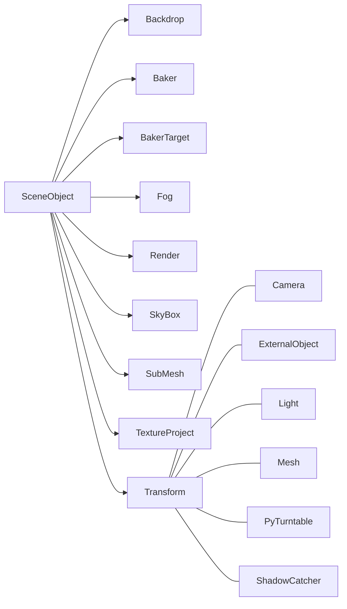

# Entities

The words **Entities** and **Modules** are not really part of the official docs.
It is just a new concept that helps to organise this Auxiliary Doc in a mnemonic manner.

Entities are the combination of various modules.

**Entities** are objects that you can add in the Scene Tab.
In other words, if you can add it to the Scene Hierarchy, then it is an entity.

All entities derive from a common ancestor called SceneObject, but there are two main groups:

- Those with Transform: those you can move around. 
- Those without Transform: there's no need to move them.

 

This is the main extructure:

 

If you create a Turntable, you will notice that it is an Entity that has two Modules: Transform and Turntable.
In the same fashion, a folder only has a Transform Module.