# User Interface

In this section, you'll find everything you need to create the UI for your addons.

Understanding the core structure of the UI code is a valuable exercise for building a solid foundation.

<!-- - **UIControl**
    - UIWindow
    - UIDrawer
    - UIScrollBox
    - UIButton
    - UILabel
    - UICheckBox
    - UIListBox
    - UIBaseSlider
        - UISliderInt
        - UISliderFloat
    - UIBaseTextField
        - UITextField
        - UITextFieldFloat
        - UITextFieldInt
    - UIColorPicker -->
<!-- 
<br> -->

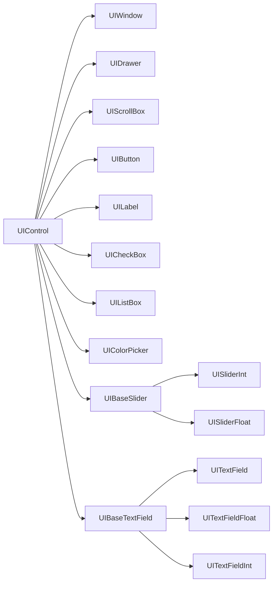

<br>

All UI members inherit from UIControl, but not all are equally significant.
The chart above is organized in a logical order, based on their functionality and importance.

<br> 

## **UIControl**

!!! warning
    The **UIControl** is the base entity from which all UI elements derive. You don't use it directly.

<br>


<br><br>
<!-- ========== SECTION BREAK ========== -->
<br><br>


## **UIWindow**

**UIWindow** is the core component for any plugin UI in Marmoset Toolbag, serving as the foundation for rendering visuals. All plugin UIs begin by creating a UIWindow, to which other UI elements are added.

<br>

```python title=""
import mset

window = mset.UIWindow()
```

<center>
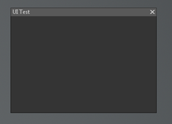
</center>

<br>

### Class

```python
class UIWindow(UIControl):
```
<p style="text-indent: 30px;">Class for creating a window. It is interesting to mention that you can create multiple windows.</p>


### Instance variables


```c#
var height 
```

<p style="text-indent: 30px;">The height of the window in pixels.</p>

```c#
var width  
```

<p style="text-indent: 30px;">The width of the window in pixels.</p>


```c#
var title  
```

<p style="text-indent: 30px;">The title of the window.</p>


```c#
var visible  
```

<p style="text-indent: 30px;">This returns true or false, depending on the state of the window.</p>


### Methods


```python
def addElement(child: UIControl) 
```

<p style="text-indent: 30px;">This is the main method through which you add elements inside the windows.</p>


```python
def addReturn()
```

<p style="text-indent: 30px;">Puts all following elements on the next line. </p>


```python
def addSpace(width: float)
```

<p style="text-indent: 30px;">This adds emtpy space and puts all following elements after it. </p>


```python
def addStretchSpace()
```

<p style="text-indent: 30px;">Puts all following elements at the end of the line. </p>


```python
def clearElements()
```

<p style="text-indent: 30px;">Removes all elements from the window. </p>


```python
def close()
```

<p style="text-indent: 30px;">Closes the current window. </p>


```python
def getElements() ‑> List[UIControl]
```

<p style="text-indent: 30px;">Returns a list of all contained controls. </p>


<br>

----------------


<br>

```python title="multiple windows example"
import mset

window1 = mset.UIWindow()
window1.title = "Window 1"
window1.height = 90
window1.width = 250

window2 = mset.UIWindow()
window1.title = "Window 2"
window1.height = 50
window1.width = 300


```


<br><br>

<!-- ========== SECTION BREAK ========== -->

<br><br>


## **UIDrawer**

**UIDrawer** is your next level tool when it comes to UI organization.
A drawer is basically a container that lives inside a Window.
It behaves like an on/off accordion.
When it's on, it will displayed the content, and hide it when it's off.

You don't really need to use it: all other UI elements can be directly added to the UIWindow. 

!!! note
    You might be tempted to simply create a UIWindow and put a drawer inside, so you can add elements directly. But this is not the way it works.
    Both UIDrawer and UIScrollBox need their own UIWindow as a base.
    Once you have that UIWindow you need to hook up them up. 

```python title="example creating a simple UIDrawer"
import mset

# This is the main and the base window to create the UI
main_window = mset.UIWindow("UI Test")

# Here we will set up a new window just for the drawer
drawer = mset.UIDrawer(name="Settings")
drawer_window = mset.UIWindow(name="Drawer Window")

# Here is where we link the new window and the drawer
drawer.containedControl = drawer_window

# Notice you can add the button to the Drawer, or to the main_window
buttonA = mset.UIButton("Close Button")
drawer_window.addElement(buttonA)

main_window.addElement(drawer)
```


<br>


!!! note
    Of course you can add many UIDrawers.

```python title="example creating lots of UIDrawer"
import mset

# This is the main and the base window to create the UI
main_window = mset.UIWindow("UI Test")

# Here we will set up a new window just for the drawer
drawer = mset.UIDrawer(name="Settings")
drawer_window = mset.UIWindow(name="Drawer Window")

# Here is where we link the new window and the drawer
drawer.containedControl = drawer_window

# Here we will set up a new window just for the drawer
drawerB = mset.UIDrawer(name="Settings")
drawerB_window = mset.UIWindow(name="Drawer Window")
drawerB.containedControl = drawerB_window

# Notice you can add the button to the Drawer, or to the main_window
buttonA = mset.UIButton("Close Button")
drawer_window.addElement(buttonA)

drawerB_window.addElement(buttonA)

main_window.addElement(drawer)
main_window.addReturn()
main_window.addElement(drawerB)
```   

<br>

!!! warning
    There is a known bug: if you create and empty Drawer, Toolbag will crash.

```python
import mset

main_window = mset.UIWindow("UI Test")
drawerA = mset.UIDrawer(name="Settings")

main_window.addElement(drawerA)
```

<center>
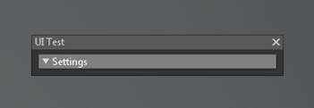
</center>

<center>
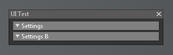
</center>


### Class

```python
class UIDrawer(UIControl):
```
<p style="text-indent: 30px;">Class for creating a drawer: which basically is a container for smaller object.</p>

### Instance variables

```c#
var containedControl 
```

<p style="text-indent: 30px;">It's basically the UIWindow that gives the UIDrawer the hability to contain other UI elements</p>


```c#
var onOpenClose 
```

<p style="text-indent: 30px;">A callback event that triggers when the drawer is opened or closed.</p>

```c#
var open 
```

<p style="text-indent: 30px;">Order the drawer to open or close</p>
```c#
var title 
```

<p style="text-indent: 30px;">The title of the drawer</p>


### Methods

```c#
var def setMinor(minor: bool)
```

<p style="text-indent: 30px;">Whether or not the drawer is dimmer.</p>


!!! warning
    There is a known bug: if you use setMinor, Toolbag will crash.


<br><br>

<!-- ========== SECTION BREAK ========== -->

<br><br>


## **UIScrollBox**

UIScrollBox is the next type of Container at your disposal for UI organization.
As with UIDrawer, UIScrollBox lives inside a Window.

And it literally is a box with a scroll

```python
import mset

window = mset.UIWindow("Test UI")
scrollbox = mset.UIScrollBox()
window.addElement(scrollbox)
```

<center>
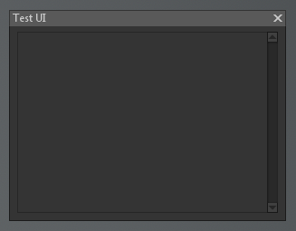
</center>

<br>

In the same way UIDrawer needed its own window, UIScrollBox also needs it.

```python title="example creting a ScrollBox"
import mset

window = mset.UIWindow("Test UI")

# create the window for the ScrollBox
scrollbox_window = mset.UIWindow()
scrollbox = mset.UIScrollBox()
scrollbox.containedControl = scrollbox_window

buttonA = mset.UIButton("Close Button")

scrollbox_window.addElement(buttonA)

window.addElement(scrollbox)
```


<br>


### Class

```python
class UIScrollBox(UIControl):
```
<p style="text-indent: 30px;">Class for creating a ScrollBox: which basically is a scrollable container.</p>


### Instance variables

```python
var containedControl
```
<p style="text-indent: 30px;">As with UIDrawer, the containedControl is basically the UIWidnow that will let the ScrollBox have the ability to add elements inside</p>


<br><br>

<!-- ========== SECTION BREAK ========== -->

<br><br>


## **UIBaseSlider**

!!! warning
    This is just an abstract class. Don't use it directly. Use **UISliderInt** and **UISliderFloat** instead. See below 👇


### Instance variables

```python
var onChange
```
<p style="text-indent: 30px;">A callback event that triggers when the slider value changes</p>


```python
var width
```
<p style="text-indent: 30px;">The width of the control.</p>


<br>

!!! note
    Don't forget all Subclasses will inherit these two variables 👆  
    Check Callbacks if you have any doubts


<br><br>

<!-- ========== SECTION BREAK ========== -->

<br><br>


## **UISliderInt**

This is a slider that counts using integers

```python
import mset

window = mset.UIWindow("Test UI")
sliderInt = mset.UISliderInt()
window.addElement(sliderInt)
```

<center>
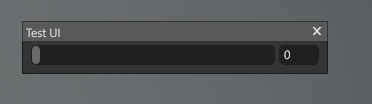
</center>


### Class

```python
class UISliderInt(UIBaseSlider):
```
<p style="text-indent: 30px;">Class for creating a UISliderInt.</p>


### Instance variables

```python
var logScale
```

<p style="text-indent: 30px;">The logarithmic exponent of the slider.</p>


```python
var logScaleCenter
```

<p style="text-indent: 30px;">The center of the logarithmic scale of the slider.</p>


```python
var max
```

<p style="text-indent: 30px;">The maximum value of the slider range.</p>


```python
var min
```

<p style="text-indent: 30px;">The minimum value of the slider range.</p>


```python
var value
```

<p style="text-indent: 30px;">The value of the slider.</p>


<br><br>

<!-- ========== SECTION BREAK ========== -->

<br><br>


## **UISliderFloat**

This is a slider that counts using floats

```python
import mset

window = mset.UIWindow("Test UI")
sliderFloat = mset.UISliderFloat()
window.addElement(sliderFloat)
```

<center>
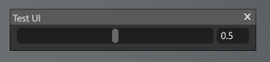
</center>


### Class

```python
class UISliderFloat(UIBaseSlider):
```
<p style="text-indent: 30px;">Class for creating a UISliderInt.</p>


### Instance variables

```python
var logScale
```

<p style="text-indent: 30px;">The logarithmic exponent of the slider.</p>


```python
var logScaleCenter
```

<p style="text-indent: 30px;">The center of the logarithmic scale of the slider.</p>


```python
var max
```

<p style="text-indent: 30px;">The maximum value of the slider range.</p>


```python
var min
```

<p style="text-indent: 30px;">The minimum value of the slider range.</p>


```python
var value
```

<p style="text-indent: 30px;">The value of the slider.</p>


<br><br>

<!-- ========== SECTION BREAK ========== -->

<br><br>


<br>

## **UIBaseTextField**

!!! warning
    This is just an abstract class. Don't use it directly. Use **UITextField**, **UITextFieldFloat** or **UITextFieldInt** instead. See below 👇

### Instance variables

```python
var onCancel
```

<p style="text-indent: 30px;">A callback that is triggered when the editing is canceled.</p>


```python
var onChange
```

<p style="text-indent: 30px;">A callback that is triggered when any editing is done.</p>


```python
var width
```

<p style="text-indent: 30px;">The width of the element</p>


<br>

!!! note
    Don't forget all Subclasses will inherit these two variables 👆  
    Check Callbacks if you have any doubts


<br><br>

<!-- ========== SECTION BREAK ========== -->

<br><br>


## **UITextField**

Enter text


```python
import mset

window = mset.UIWindow("Test UI")
textField = mset.UITextField()
window.addElement(textField)
```

<center>
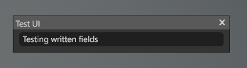
</center>

<br>

```python
var value
```

<p style="text-indent: 30px;">The content of the text field.</p>


<br><br>

<!-- ========== SECTION BREAK ========== -->

<br><br>


## **UITextFieldFloat**

Same as TextField but this version works with float numbers

```python
import mset

window = mset.UIWindow("Test UI")
textFieldFloat = mset.UITextFieldFloat()
window.addElement(textFieldFloat)
```

<center>
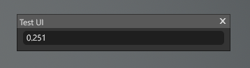
</center>

<br>


<br><br>

<!-- ========== SECTION BREAK ========== -->

<br><br>


## **UITextFieldInt**

UI text field that exclusively works with int values.

```python
import mset

window = mset.UIWindow("Test UI")
textFieldInt = mset.UITextFieldInt()
window.addElement(textFieldInt)
```

<center>
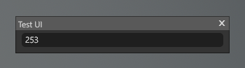
</center>

<br>

<br>


<br><br>

<!-- ========== SECTION BREAK ========== -->

<br><br>


## **UIButton**

Add a button to perfom an action when clicked.

```python
import mset

window = mset.UIWindow("Test UI")
myButton = mset.UIButton("click me") #dont forget to add a name like 'click me'
window.addElement(myButton)
```

<center>
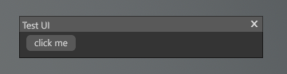
</center>

<br>


<br><br>

<!-- ========== SECTION BREAK ========== -->

<br><br>


## **UICheckBox**

A small square box that can be checked or unchecked to toggle an option on or off.

```python
import mset

window = mset.UIWindow("Test UI")
myCheckBox = mset.UICheckBox()
window.addElement(myCheckBox)
```

The images has two checkboxes, to show you both states.
<center>
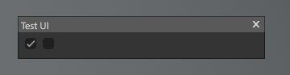
</center>


<br>


<br><br>

<!-- ========== SECTION BREAK ========== -->

<br><br>


## **UIColorPicker**

A small square box that can be checked or unchecked to toggle an option on or off.

```python
import mset

window = mset.UIWindow("Test UI")
myColorPicker = mset.UIColorPicker()
window.addElement(myColorPicker)
```

<!-- most probably I need to circle the little square to improve the readability of the image -->
Click on the little square to actually open the Color Picker Popup

<center>
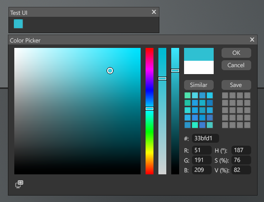
</center>

<br>


<br><br>

<!-- ========== SECTION BREAK ========== -->

<br><br>


## **UILabel**

Very similar to **UITextField**, but this text is not inside a box.

```python
import mset

window = mset.UIWindow("Test UI")
myLabel = mset.UILabel("My label") # 👈 remember to actually add a label
window.addElement(myLabel)
```

<center>
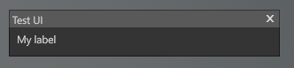
</center>

<br>


<br><br>

<!-- ========== SECTION BREAK ========== -->

<br><br>


## **UIListBox**

This is a box that contains a list.
It is really useful when you want to select something from a set of options.
Or when your actual behaviour, depends on that option.

```python
import mset

window = mset.UIWindow("Test UI")
myList = mset.UIListBox("Name of the list") # 👈 remember to actually add a name

myList.addItem("Item 1")
myList.addItem("Item 2")
myList.addItem("Item 3")

window.addElement(myList)
```

Notice this is just a simple list of strings for demonstration purposes.

<center>
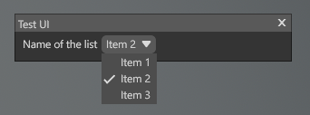
</center>

<br>

### Instance variables

```python
var onMenuOpen
```

<p style="text-indent: 30px;">Callback that triggers when the list is opened</p>


```python
var onSelect
```

<p style="text-indent: 30px;">Callback that triggers when you confirm the selection of an item</p>

```python
var selectedItem
```

<p style="text-indent: 30px;">Returns the current selected item in the ListBox.</p>


```python
var title
```

<p style="text-indent: 30px;">The text title of the ListBox.</p>


### Methods

```python
def addItem(item: str)
```

<p style="text-indent: 30px;">Adds an item with the label specified to the ListBox.</p>


```python
def clearItems()
```

<p style="text-indent: 30px;">Removes all items from this ListBox.</p>


```python
def selectItemByName(name: str)
```

<p style="text-indent: 30px;">Selects the item that matches the name specified.</p>

```python
def selectNone()
```

<p style="text-indent: 30px;">Select no item on the list.</p>

